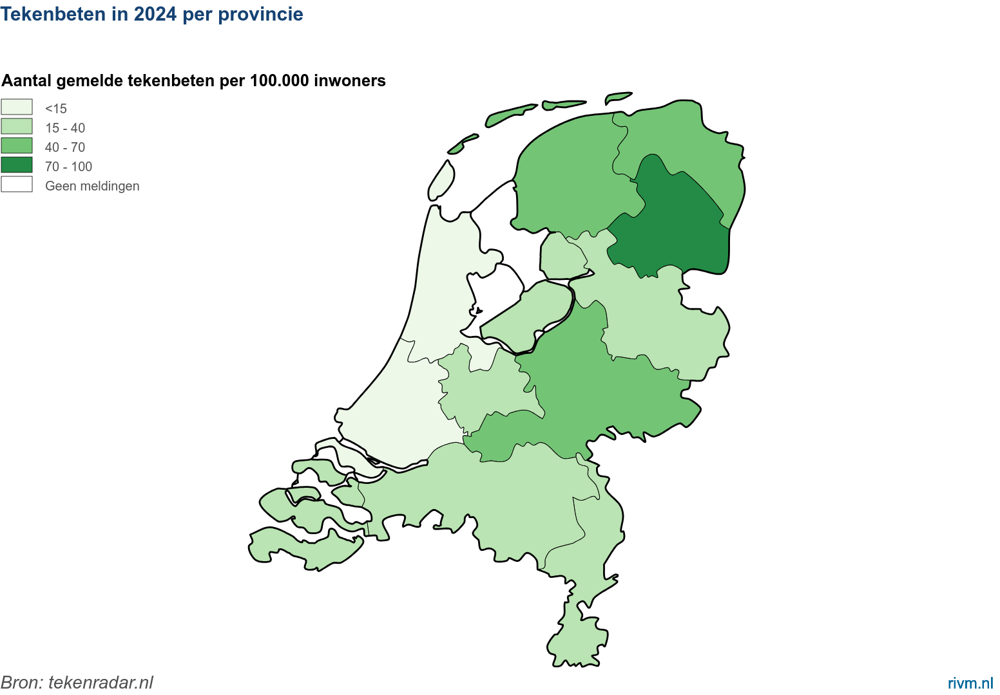

*31 maart 2025, bericht van Wageningen University en RIVM*

**Nederlanders verwijderen teken sneller dan tien jaar geleden. Dat blijkt uit onderzoek van Tekenradar.nl. In 2024 werd de helft van de teken binnen 11 uur verwijderd. In 2014 was dit nog binnen 14 uur. Het is belangrijk dat deze tijd kort is. Hoe sneller je een teek verwijdert, hoe kleiner de kans op de ziekte van Lyme.**

 

---

Al meer dan 10 jaar melden jaarlijks duizenden mensen uit heel Nederland hun tekenbeten via Tekenradar.nl. Sinds 2013 krijgen melders de vraag hoe lang de teek in de huid heeft vastgezeten. Uit die meldingen blijkt dat de helft van de teken in 2024 binnen elf uur werd verwijderd. Een kwart van de mensen had de teek al binnen vier uur verwijderd. Bij een kwart van de mensen zat de teek langer dan 24 uur en soms wel dagenlang vast voordat ze werd verwijderd.

Tien jaar geleden duurde het langer voordat een teek werd verwijderd. Toen verwijderde de helft van de mensen een teek binnen 14 uur na de beet. Een kwart van de mensen had de teek binnen 5 uur verwijderd en een kwart van de mensen liet een teek langer dan 26 uur zitten.

### Daling positief, maar…

Hoe sneller je een teek verwijdert, hoe kleiner de kans op de ziekte van Lyme. “Het is dus goed dat we teken nu sneller verwijderen” zegt RIVM-onderzoeker Kees van den Wijngaard. “Maar we zijn er nog niet omdat we sinds 2016 geen duidelijk verdere verkorting van de verwijdertijd zien optreden. Het advies is en blijft om een teek na een beet zo snel mogelijk te verwijderen. Daarbij is het belangrijk dat een teek op tijd opgemerkt wordt. Vandaar dat de slogan van de [Week van de Teek](https://www.weekvandeteek.nl) al jarenlang is: Na een bezoek aan het groen een tekencheck doen.”

### Drenthe weer op eerste plaats

In 2024 gaven Nederlanders in totaal 6.035 tekenbeten door. De meeste meldingen (1.023 tekenbeten) kwamen uit Gelderland. “Maar ook uit andere provincies kregen we honderden meldingen”, vertelt bioloog Arnold van Vliet van Wageningen University. “De provincie Drenthe had net als vorige jaren veruit de meeste meldingen per 100 duizend inwoners. De 99 per 100 duizend was ook duidelijk hoger dan de 71 van vorig jaar. Gelderland staat met 48 op de tweede plaats en Groningen met 45 meldingen per 100 duizend op de derde plaats. Zuid-Holland had met 12 meldingen van tekenbeten per 100 duizend inwoners het laagste aantal”.

<figure className="article-figure">
  
  <figcaption>Figuur 1: Aantal tekenbeten per provincie in 2024 (Bron: Tekenradar.nl)</figcaption>
</figure>

### Sterke toename komende twee maanden

De afgelopen weken liep het aantal tekenbeten door de stijgende temperaturen langzaam op. De aantallen blijven nog wat achter bij vorig jaar. Waarschijnlijk komt dat doordat februari en maart 2024 de warmste ooit waren. De komende twee maanden zal het aantal tekenbeten sterk toenemen. Het is onduidelijk hoe groot de tekenpopulatie dit jaar is. Dat bepaalt ook hoeveel mensen er gebeten gaan worden. Ons gedrag in het groen speelt ook een rol en dat wordt weer mede bepaald door het weer.

### Meld tekenbeten via Tekenradar.nl
Iedereen kan tekenbeten en Lyme-klachten melden via [Tekenradar.nl](https://www.tekenradar.nl). “Zo weten we waar en wanneer  mensen de meeste tekenbeten oplopen”, legt Van den Wijngaard uit. “En kunnen we mensen beter helpen om zich daartegen te beschermen.” Sinds 2022 vragen we mensen om wekelijks door te geven of ze wel of niet gebeten zijn in de voorgaande week. Zo krijgen we een beter beeld van het verloop van het risico op tekenbeten door het jaar heen. Aanmelden voor de wekelijkse melding kan via het [centrale meldformulier](https://www.tekenradar.nl/melden). Vul dan bij de vraag ‘Wil je wekelijks doorgeven hoeveel tekenbeten je hebt gehad?’ het antwoord ‘Ja’ in.

