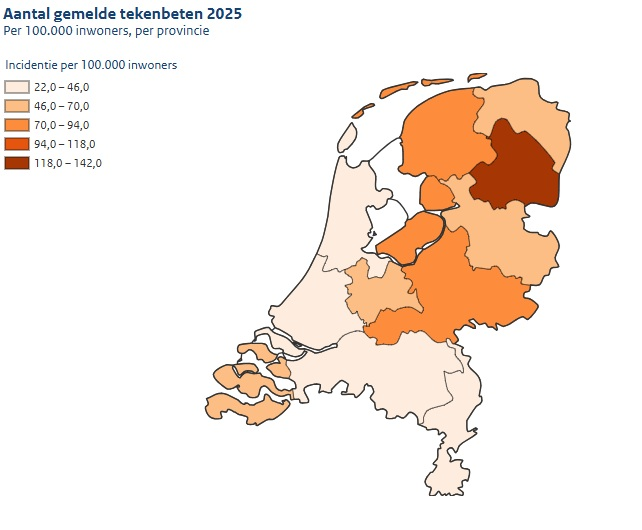

*30 maart 2026*

**In 2025 gaven Nederlanders 10.795 tekenbeten door via Tekenradar.nl. Dat was 41% meer dan in 2024. Vooral in juni en juli waren er meer tekenbeetmeldingen dan gemiddeld. Het totale aantal meldingen was niet zo hoog sinds 2020. Niet iedereen meldt een teek, het werkelijke aantal tekenbeten in 2025 zal (naar schatting) ruim boven de miljoen liggen.**

 

---
In 2025 gaven Nederlanders 10.795 tekenbeten door via Tekenradar.nl. Dat was 41% meer dan in 2024. Vooral in juni en juli waren er meer tekenbeetmeldingen dan gemiddeld. Het totale aantal meldingen was niet zo hoog sinds 2020. Gezien deze stijging zal het werkelijke aantal tekenbeten in 2025 ruim boven de miljoen liggen.

## Wekelijkse meldingen
Dat er in 2025 ook echt meer tekenbeten waren en niet alleen meer meldingen, blijkt uit wekelijks onderzoek van Tekenradar.nl. Elke week geven een paar honderd Nederlanders door of zij een tekenbeet hebben gehad. Ook in deze groep lag het aantal meldingen in 2025 flink hoger dan in de jaren ervoor. Zo werd drie weken lang zo’n 25% van de wekelijkse melders door een teek gebeten. In 2023 en 2024 bleef dit aantal het hele jaar onder de 20%. 

## Meeste kans op een tekenbeet in Drenthe
De kans op een tekenbeet was vorig jaar per hoofd van de bevolking het hoogst in de provincies: 
- Drenthe (142 gemelde tekenbeten per 100.000 inwoners)
- Gelderland (83 gemelde tekenbeten per 100.000 inwoners)
- Flevoland (79 gemelde tekenbeten per 100.000 inwoners)

De kans op een tekenbeet was vorig jaar per hoofd van de bevolking het laagst in de provincies:
- Zuid-Holland (22 gemelde tekenbeten per 100.000 inwoners)
- Noord-Holland (29 gemelde tekenbeten per 100.000 inwoners)
- Noord-Brabant (40 gemelde tekenbeten per 100.000 inwoners) 

<figure className="article-figure">
  
  <figcaption>Figuur 1. Aantal tekenbeetmeldingen op tekenradar.nl per 100.000 inwoners per provincie in 2025 (Bron: Tekenradar.nl)</figcaption>
</figure>

## Teken ook nu weer actief
De laatste weken loopt het [aantal meldingen](https://www.rivm.nl/tekenbeten/actueel) weer op. Door de hoge temperaturen zijn veel teken weer actief geworden. Controleer jezelf daarom goed na een bezoek aan het groen. Oók als je in een stadspark of je eigen achtertuin bent geweest. En [verwijder](https://www.rivm.nl/tekenbeten/tekenbeet/verwijderen) een gevonden teek meteen. 

## Belangrijk om tekenbeten te melden
“Teken kunnen ziektes overbrengen, zoals de ziekte van Lyme”, vertelt RIVM-onderzoeker Kees van den Wijngaard. “Lyme kan klachten geven waar mensen soms lang last van kunnen houden. Daarom is het belangrijk om te weten waar en hoe vaak teken en Lyme voorkomen.” Op [Tekenradar.nl](https://www.tekenradar.nl/home) kunnen mensen een tekenbeet doorgeven, én lymeklachten, zoals een steeds groter wordende rode ring of vlek rond de plek van de tekenbeet, koorts, spierpijn of gewrichtspijn. 

## Meer weten of een tekenbeet melden?  
- Kijk op [rivm.nl/tekenbeet](https://www.rivm.nl/tekenbeten). 
- Meld een tekenbeet via [Tekenradar.nl](https://www.tekenradar.nl/home).
- Meld je aan als wekelijkse melder op [Tekenradar.nl](https://www.tekenradar.nl/home). Meedoen kost ongeveer één minuut per week en je helpt mee aan een nog beter inzicht in tekenbeten.
