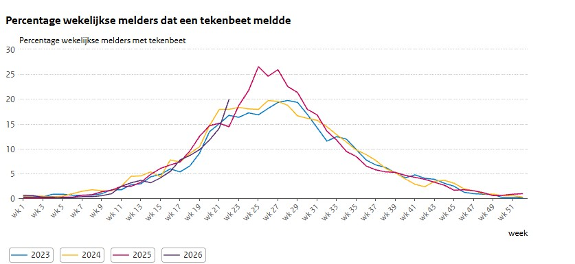

*4 juni 2026, bericht van Wageningen University en RIVM*

**Het aantal mensen dat een tekenbeet oploopt ligt al vroeg op een hoog niveau. In de week van 25 mei gaf 28% van de wekelijkse melders op Tekenradar.nl aan dat ze gebeten waren door een teek. Dit aantal is duidelijk hoger dan in voorgaande jaren rond eind mei. Een bijzondere combinatie van weersomstandigheden veroorzaakte de stijging. De piek in tekenbeten is naar verwachting nog niet bereikt.**

 

---
De regen halverwege mei kwam voor teken als geroepen. Net als een jaar geleden verliep het voorjaar extreem droog. In april viel regionaal maar enkele millimeters aan regen. Zeer droge omstandigheden vergroten de kans op uitdroging van teken die op de strooisellaag of op planten als bosbes, gras en varens zitten te wachten op een gastheer waar ze bloed bij kunnen drinken. Halverwege mei viel er dan eindelijk wat regen wat ervoor zorgde dat de bovenste laag van de bodem en de vegetatie vochtiger werd. Het was tegelijkertijd wel relatief koud voor de tijd van het jaar maar de laatste 10 dagen van mei verliepen juist weer extreem warm, zeer zonnig en droog. Die omstandigheden zijn ideaal voor teken, maar ook mensen trekken er graag op uit gedurende een lang vrij Pinksterweekend met mooi weer, of ze gaan aan de slag in de tuin.

Op Tekenradar.nl zagen we vanaf het Pinksterweekend een zeer sterke toename in het aantal tekenbeetmeldingen. Het totaal aantal meldingen kwam die week ruim boven het aantal meldingen dat in de voorgaande jaren in diezelfde week gedaan werd. Ook bij de honderden mensen die wekelijks via Tekenradar.nl melden of ze wel of niet gebeten zijn steeg het percentage van de mensen die een tekenbeet opliep in een week tijd van 16% tot 28%. Daarmee komt het op het niveau van de piekweek van vorig jaar maar dan ruim een week vroeger. [Vorig jaar steeg het aantal tekenbeetmeldingen ook sterk](https://www.tekenradar.nl/nieuws/2025-06-06) nadat het eindelijk regende na een extreem droge periode.

<figure className="article-figure">
  
  <figcaption>Figuur 1. Wekelijks meldt een panel via Tekenradar.nl of zij in de afgelopen week wel of niet gebeten zijn. Het percentage is het deel van het panel dat gebeten is (gemiddeld over drie weken). (Bron: Tekenradar.nl)</figcaption>
</figure>

## De piek moet nog komen, zomers en droog
De komende dagen staat er aardig wat regen in de verwachting. Het zal een flinke verlichting geven voor de natuur die nog steeds te maken heeft met droogte. Het zal ook de teken goed doen. Tegelijkertijd geeft de meerdaagse weersverwachting aan dat we vanaf aankomend weekend wederom met een warme en droge zomerse periode te maken gaan krijgen waardoor waarschijnlijk veel mensen het groen in trekken. De maanden juni en juli zijn normaal gesproken de piekmaanden wat betreft het aantal tekenbeten. Vorig jaar liep het aantal tekenbeten in juni flink op. Uiteindelijk zorgde de zomerpiek ervoor dat het aantal tekenbeetmeldingen op Tekenradar.nl het [hoogste was in vijf jaar tijd](https://www.tekenradar.nl/nieuws/2026-03-30). Gegeven de huidige weersomstandigheden en de snelle toename in het aantal tekenbeten in de afgelopen week moeten we wederom rekening houden met een relatief hoge piek. Hoe hoog de piek uit gaat vallen is uiteraard nog even afwachten.

## Tekencheck en (wekelijks) melden op Tekenradar.nl
‘Na een bezoek aan het groen een tekencheck doen’ geldt met de stijgende temperaturen door klimaatverandering inmiddels eigenlijk jaarrond, dus ook in de winter. Met de huidige situatie en vooruitzichten is dit de komende maanden extra belangrijk. Meer [informatie over teken en tekenbeten](https://www.tekenradar.nl/informatie/teken) vind je op Tekenradar.nl.  
Op [Tekenradar.nl](https://www.tekenradar.nl/melden) kunnen mensen een tekenbeet doorgeven, én lymeklachten, zoals een steeds groter wordende rode ring of vlek, meestal rond de plek van de tekenbeet, koorts, spierpijn of gewrichtspijn. 
Je kunt je op [Tekenradar.nl](https://www.tekenradar.nl/melden) ook opgeven als wekelijkse melder. Meedoen kost ongeveer één minuut per week en je helpt mee aan een nog beter inzicht in hoe het risico op tekenbeten verschilt tussen verschillende momenten in het jaar en tussen verschillende gebieden.

## Teken in advies Gezondheidsraad en Wetenschappelijke Klimaatraad
Tekenactiviteit, het aantal teken dat ergens voorkomt en de ziekteverwekkers die ze bij zich dragen, maar ook ons eigen gedrag en hoe we ons landschap inrichten worden op tal manieren bepaald door weersomstandigheden. Klimaatverandering zal dan ook invloed hebben op al deze variabelen en daarmee op de gezondheidsrisico’s en -problemen die teken veroorzaken. Dat is ook de reden waarom teken nadrukkelijk genoemd worden in het recent gepubliceerde gezamenlijk advies aan het kabinet van de Gezondheidsraad en de Wetenschappelijke Klimaatraad [“Klimaatverandering en gezondheid: richtingen voor beleid"](https://www.gezondheidsraad.nl/adviesonderwerpen/omgeving/klimaatverandering-en-gezondheid-richtingen-voor-beleid). De veranderingen in de afgelopen jaren en maanden in het klimaat en de natuur laten zien dat we ons moeten voorbereiden op continu veranderende en nieuwe situaties. Extra belangrijk om de ontwikkeling van teken, tekenbeten en ziekte door tekenbeten op de voet te volgen.
