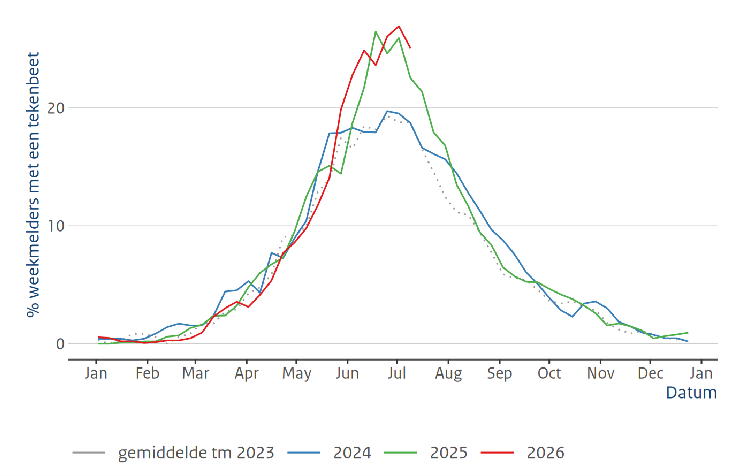
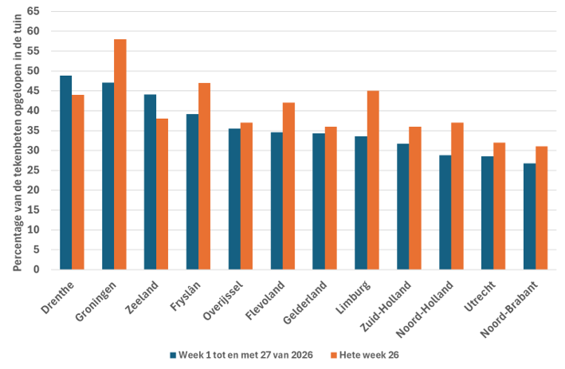

*15 juli 2026, bericht van Wageningen University en RIVM*

**Tijdens de extreem warme week eind juni had voor het eerst meer dan 30% van de wekelijkse melders van Tekenradar.nl een tekenbeet. Ook tijdens de huidige warme dagen is het na het bezoek aan het groen belangrijk om een tekencheck te doen. Tijdens de zeer warme weken werden relatief meer tekenbeten opgelopen in de tuin.**

 

---

Op 4 juni meldden we dat het aantal mensen met een tekenbeet vroeg opliep maar dat de piek nog niet bereikt was. Die piek werd in de zeer warme week van 22 juni (week 26) bereikt. Van de 673 mensen die wekelijks hun tekenbeten meldden,  had in die week 31,7% een tekenbeet opgelopen. 

<figure className="article-figure">
  
  <figcaption>Figuur 1. Wekelijks meldt een panel via Tekenradar.nl of zij in de afgelopen week wel of niet gebeten zijn. Het percentage is het deel van het panel dat gebeten is, in de grafiek is het gemiddelde over 3 opeenvolgende weken weergegeven (Bron: Tekenradar.nl)</figcaption>
</figure>

## Meer tekenbeten in de tuin in heetste week van 2026
In de heetste week werden ook nog meer dan 800 tekenbeten doorgegeven via Tekenradar.nl. Het lijkt erop dat het percentage tuintekenbeten in die hete week hoger lag in de meeste provincies (zie Figuur 2). Alleen in Drenthe en Zeeland lag het aantal tuintekenbeten lager. Wat verder opvalt aan Figuur 2 is dat het percentage tekenbeten in de tuin zo verschilt tussen de provincies. In Drenthe, Groningen en Zeeland wordt meer dan 40% van de tekenbeten opgelopen in de tuin terwijl in Noord-Holland, Utrecht en Noord-Brabant het percentage tuintekenbeten onder de 30 procent ligt. Waar dat verschil door verklaard wordt is niet bekend. Dit jaar werd landelijk 34% van de tekenbeten opgelopen in de tuin en 47% in het bos.

<figure className="article-figure">
  
  <figcaption>Figuur 2: Het percentage van de tekenbeten gemeld via Tekenradar.nl dat in de tuin is opgelopen, gemiddeld per provincie in week 1 tot en met 27 van 2026 (blauw) en in de hete week 26 (Bron: Tekenradar.nl)</figcaption>
</figure>

## Weer een warme periode
De temperatuur lijkt heel bepalend te zijn voor het aantal tekenbeten dat wordt opgelopen. Momenteel hebben we weer te maken met een warme periode. De kans is groot dat daarmee het aantal tekenbeten nog hoog blijft. De vraag is wel of de droogte zorgt voor een verminderde tekenactiviteit. In juni viel er gemiddeld over het land 85 millimeter regen. Vooral in de eerste helft van het land. Inmiddels is het al weer geruime tijd droog en loopt het neerslagtekort weer flink op. Als de vegetatie en de bovenste laag van de bodem uitdrogen lopen teken het risico om uit te drogen en te sterven. De komende maanden zullen we zien of dit effect zich heeft voorgedaan. Het advies blijft dus gewoon ‘Na het bezoek aan het groen een tekencheck doen’.
