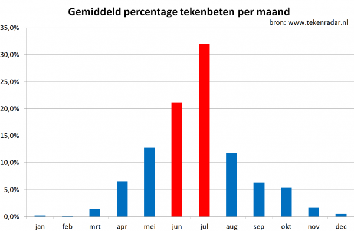
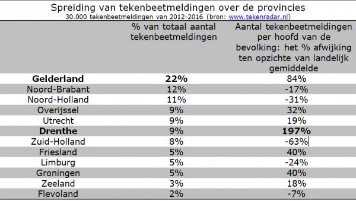

## Patiënt ziek door teken-encefalitisvirus
*21 juli 2016*
  

**Voor de eerste keer is in Nederland een patiënt ziek geworden door een teek die het teken-encefalitisvirus (TBE-virus) bij zich droeg. De besmetting trad zeer waarschijnlijk op na een tekenbeet tijdens een wandeling op de Utrechtse Heuvelrug.  Inmiddels is de patiënt herstellende. Onlangs werd op de Sallandse Heuvelrug het teken-encefalitisvirus (TBE-virus) aangetroffen in teken. Het virus komt voor in verschillende landen in Noord, Midden- en Oost-Europa, waaronder Duitsland en Oostenrijk.**
  

#### Teken-encefalitis
Een infectie met het TBE-virus verloopt meestal zonder klachten, maar het TBE-virus kan na een griepachtig ziektebeeld, een ontsteking van de hersenvliezen en hersenen (meningo-encefalitis)  veroorzaken. Teken dragen het virus over van dier-naar-dier en soms naar de mens. De ziekte staat ook bekend als FSME (Frühsommer-Meningoenzephalitis) en Tick Borne Encephalitis. Als mensen wel ziek worden, verloopt dat meestal in twee fasen. Zeven tot 14 dagen na de tekenbeet krijgt men koorts, hoofdpijn, vermoeidheid en spier- en gewrichtspijn. Vervolgens is er ongeveer een week zonder klachten. Bij een klein aantal mensen met een infectie kan daarna hersen(vlies)ontsteking ontstaan vaak met ernstige hoofdpijn en hoge koorts. Dan is ziekenhuisopname noodzakelijk. Er is geen behandeling voor een hersen(vlies)ontsteking door TBE-virus. Meestal herstelt de patiënt volledig. Het RIVM adviseert medisch specialisten om bij patiënten met een hersen(vlies)ontsteking  en een recente tekenbeet voortaan ook aan teken-encefalitis te denken.

#### Voorkom tekenbeten
Het TBE-virus wordt door tekenbeten overgedragen. Het is dan ook belangrijk om tekenbeten te voorkomen, vaak te controleren op tekenbeten en teken dan direct te verwijderen.
  
<figure className="article-figure">
  
  <figcaption>Teken op nagel van een duim. Linksboven vrouwtje, daaronder het mannetje, rechtsboven de nimf en daaronder een larfje (bron: RIVM)</figcaption>
</figure>

#### TBE-virus in teken
Het RIVM heeft reeënonderzocht op aanwezigheid van antistoffen tegen het TBE-virus. Een klein deel van de reeën was positief, met name op de Sallandse Heuvelrug. In dat gebied zijn daarna teken gevangen en in een paar teken werd het TBE-virus aangetroffen. Nu is er een besmette teek ontdekt na een wandeling op de Utrechtse heuvelrug. Samen met andere organisaties (Dutch Wildlife Health Center en Nederlandse Voedsel- en Warenautoriteit) onderzoekt het RIVM de verspreiding van het TBE-virus in Nederland en hoe groot de kans is om een infectie op te lopen.

[Klik hier voor meer informatie over TBE](/informatie/tekenencefalitis).

---
## Teken-encefalitisvirus in Nederland aangetroffen
*30 juni 2016*
  

**In teken op de Sallandse Heuvelrug is het teken-encefalitisvirus (TBE-virus) aangetroffen. Het is voor het eerst dat dit virus in teken is aangetroffen in Nederland. Er zijn geen patiënten bekend die in Nederland besmet zijn geraakt met het virus. Hoewel het risico op teken-encefalitis na een tekenbeet veel kleiner is dan op de ziekte van Lyme, is dit een extra reden om alert te zijn op tekenbeten.**
  

<figure className="article-figure">
  
</figure>
Het RIVM heeft aanvankelijk reeën onderzocht op aanwezigheid van antistoffen tegen het TBE-virus. Een klein deel van de reeën was positief, met name op de Sallandse Heuvelrug. In dat gebied zijn daarna teken gevangen en in een paar teken werd het TBE-virus gevonden. Er zijn geen patiënten bekend die in Nederland besmet zijn geraakt met het TBE-virus. Er zijn wel Nederlandse patiënten met teken-encefalitis maar zij zijn in het buitenland besmet geraakt met het virus. Binnen Europa komt het virus in meerdere landen voor, zoals Duitsland en Oostenrijk. Samen met andere organisaties onderzoekt het RIVM de verspreiding van het TBE-virus en hoe groot het risico is om in Nederland teken-encefalitis op te lopen.

 [Lees het volledige bericht](https://www.rivm.nl/nieuws/teken-encefalitisvirus-in-nederland-aangetroffen)

---
## Ruim helft van alle tekenbeten in juni en juli
*27 juni 2016*
  

**Komende maand is de piek van het tekenseizoen met naar verwachting ruim 400.000 tekenbeten. In mei en juni werden op Tekenradar.nl tot nu toe 13 procent meer tekenbeten gemeld dan het gemiddelde van de voorgaande drie jaren, 3500 in totaal. Teken kunnen de ziekte van Lyme overbrengen. Het is belangrijk dat mensen na een bezoek ‘aan het groen’ zichzelf controleren en teken snel verwijderen. Mensen die na een tekenbeet de ziekte van Lyme krijgen kunnen meedoen aan onderzoek via Tekenradar.nl.**
  

#### Helft van alle tekenbeten in juni en juli
Tekenradar.nl ontvangt in juni en juli gemiddeld de helft van alle tekenbeetmeldingen in een jaar. De piek van de meldingen ligt in juli. Aangezien jaarlijks 1,3 miljoen tekenbeten vóórkomen, zullen naar verwachting de komende maand ruim 400.000 tekenbeten worden opgelopen. In de eerste helft van 2016 zijn er tot nu toe 8 procent meer tekenbeten gemeld dan het gemiddelde van de voorgaande drie jaren. De helft van alle tekenbeten dit jaar zijn in het bos opgelopen en een derde in de tuin. Een derde van de gemelde tekenbeten zijn opgelopen tijdens het wandelen, 20 procent tijdens het tuinieren en 20 procent van de tekenbeten bij het spelen. Het aantal tekenbeetmeldingen hangt in belangrijke mate samen met de weersomstandigheden. Daarnaast speelt de aandacht voor Tekenradar.nl waarschijnlijk een rol.
  
<figure className="article-figure">
  
</figure>

#### Meeste tekenbeetmeldingen in Gelderland, grootste risico op tekenbeet in Drenthe
Van de in totaal ruim 30.000 tekenbeetmeldingen tussen 2012 en 2016 komen de meeste uit Gelderland. Ongeveer 22% van de meldingen komen uit deze provincie. Als je het aantal tekenbeetmeldingen weegt per aantal inwoners, blijkt dat inwoners uit Drenthe het grootste risico lopen op een tekenbeet. Het gaat om bijna drie keer zo veel tekenbeetmeldingen per inwoner als gemiddeld in Nederland.
<figure className="article-figure">
  
</figure>

#### Verwijder een tekenbeet snel!
Hoe langer de teek in de huid zit, hoe groter de kans dat de teek ziekteverwekkers overdraagt. Het is daarom belangrijk dat mensen zich controleren na een bezoek aan het groen en teken direct verwijderen als ze zich vastgebeten hebben in de huid. Tot drie maanden na de beet kan op de huid een rode vlek of ring ontstaan. Krijgt u deze huiduitslag of andere klachten zoals koorts en eventueel spier- en gewrichtspijn in de eerste weken na een tekenbeet, neem dan contact op met uw huisarts. Dit kunnen namelijk signalen zijn van de ziekte van Lyme.

#### Onderzoek naar langdurige klachten
Mensen bij wie de ziekte van Lyme is vastgesteld kunnen meedoen aan het LymeProspect onderzoek via Tekenradar.nl. Onderzocht wordt hoe langdurige klachten na Lyme beter voorkómen en behandeld kunnen worden. Mensen die een antibioticakuur beginnen tegen de ziekte van Lyme kunnen zich via www.tekenradar.nl of via de behandelend arts aanmelden voor deelname. De gezondheid van de deelnemers wordt een jaar gevolgd. Dit jaar kunnen 500 mensen meedoen aan het onderzoek.
  
<figure className="article-figure">
  
  <figcaption>De huiduitslag bij besmetting met de Lymebacterie kan er uit zien als een ring, maar ook als een egaal gekleurde vlek. Zie voor meer voorbeelden www.tekenradar.nl</figcaption>
</figure>

#### Samenwerkingspartners
Tekenradar.nl is een samenwerking van Wageningen University en het RIVM.
Het LymeProspect onderzoek is een samenwerking van het RIVM, Radboudumc, AMC en Gelre ziekenhuizen Apeldoorn, en wordt mede mogelijk gemaakt door ZonMw en het ministerie van VWS.

---
## Wat vergroot de kans dat u een tekencheck doet?
*17 april 2016*
  

**Volgens Tekenradar.nl neemt de tekenactiviteit weer sterk toe. Veel mensen vergeten zichzelf na een bezoek aan het groen echter te controleren op tekenbeten. Ze lopen daarmee onnodig een groter risico op het krijgen van de ziekte van Lyme. Uit een enquête onder bijna 600 mensen blijkt dat we eerder een tekencheck doen als we erop vertrouwen dat we zo’n check kunnen uitvoeren.**
  

De enquête werd in januari online afgenomen door Amy van der Heijden in het kader van haar scriptie bij de leerstoelgroepen Strategische Communicatie en Milieusysteemanalyse van Wageningen University.  Het onderzoek moest meer inzicht geven in wat natuurbezoekers beweegt om zichzelf op teken te controleren na een bezoek aan de natuur.

De helft van de mensen bleek zichzelf niet of nauwelijks te controleren op tekenbeten na een bezoek aan de natuur. De enquête werd midden in de winter uitgevoerd dus mogelijk waren mensen in de veronderstelling, overigens ten onrechte, dat teken in de winter niet actief zijn. Overigens blijken veel mensen zich ook midden in het tekenseizoen niet op teken te checken, terwijl dat de beste manier is om het oplopen van de ziekte van Lyme te voorkomen. Dat mensen zich niet checken is opvallend aangezien 60 procent van de mensen denkt dat het risico groot is dat ze door een teek worden gebeten als ze de natuur in gaan. Daarbij geeft 85 procent van de mensen aan dat ze Lyme als een ernstige ziekte zien en denkt 60 procent dat Lyme moeilijk te genezen is. Daarentegen acht slechts 17 procent de kans groot dat ze de ziekte van Lyme oplopen na een tekenbeet. De tekencheck wordt door 70 procent van de mensen gezien als een effectieve tot zeer effectieve manier om de ziekte van Lyme te voorkomen.

#### Vertrouwen in eigen kunnen
Een op de drie mensen vindt het lastig tot zeer lastig om een tekencheck uit te voeren. Het bleek dat als mensen er meer vertrouwen in hebben dat ze een tekencheck op een goede manier uit kunnen voeren, ze meer geneigd zijn om de tekencheck te doen. Dit vertrouwen in eigen kunnen wordt lager als mensen geen pincet of tekentang bij de hand hebben om de teek te verwijderen, of als er geen spiegel is waarmee plaatsen bekeken kunnen worden die lastig te bekijken zijn, zoals de rug. Omdat de meeste mensen privacy willen om de tekencheck te doen, kan het gezelschap van anderen ook een belemmering zijn.

#### Tips voor thuis
Indien u het lastig vindt om een tekencheck uit te voeren, dan raden we u aan om deze film te bekijken. Daaruit blijkt dat het doen van een tekencheck niet moeilijk is. Het is zaak om systematisch van boven naar beneden of van beneden naar boven het lichaam te controleren op teken, waarbij extra aandacht wordt besteed aan warme plaatsen van het lichaam, zoals liezen, oksels of knieholten. Voor plaatsen die niet goed zichtbaar zijn kan een spiegel gebruikt worden. Indien een teek wordt gevonden, kan deze verwijderd worden met een puntig pincet of een tekentang. Een handig advies is dus om er voor te zorgen dat u een spiegel en een puntig pincet of tekentang bij de hand heeft. Meldt een tekenbeet of een rode ring of vlek als gevolg van de ziekte van Lyme op Tekenradar.nl.

*Tekst: Amy van der Heijden, Bob Mulder en Arnold van Vliet, Wageningen University*

---
## Vlekvormige huiduitslag na tekenbeet kan ook ziekte van Lyme zijn
*11 april 2016*
  

**De huiduitslag door de ziekte van Lyme is niet altijd een karakteristieke ‘rode ring’, maar kan ook een egaal gekleurde vlek zijn. Bij 1 op de 3 mensen met een huiduitslag door de ziekte van Lyme ontstaat zo’n egaal gekleurde vlek. Deze egale huiduitslag is moeilijker te herkennen en te onderscheiden van andere aandoeningen. Kenmerkend voor zowel de ring als de vlek is dat deze steeds groter wordt. Snel herkennen is belangrijk, omdat tijdige behandeling ernstigere klachten kan voorkomen. Afgelopen jaar zijn er twaalfduizend tekenbeten gemeld via Tekenradar.nl.**
  

#### Ziekte van Lyme herkennen
<figure className="article-figure">
  
  <figcaption>Verschillende vormen van de huiduitslag door de ziekte van Lyme. De huiduitslag kan er uit zien als een ring, maar ook als een egaal gekleurde vlek.</figcaption>
</figure>
In het LymeProspect onderzoek zijn 150 foto’s van een huiduitslag na een tekenbeet geanalyseerd. Hieruit blijkt dat bij een derde van de patiënten geen ‘rode ring’ ontstaat, maar een egaal gekleurde vlek. Zo’n vlek is moeilijker te herkennen en onderscheiden van andere huidaandoeningen. Een onderscheidend kenmerk voor de ziekte van Lyme is dat de huiduitslag (zowel de ring als de egaal gekleurde vlek) zich uitbreidt, en meestal groter wordt dan 5 cm. Voorbeelden van de verschillende vormen van de huiduitslag die duiden op de ziekte van Lyme zijn te vinden op [www.tekenradar.nl](/home).

#### Onderzoek naar langdurige klachten
Mensen die beginnen met een behandeling voor de ziekte van Lyme kunnen via Tekenradar.nl meedoen aan het LymeProspect onderzoek. Voortaan kunnen ook mensen met ernstiger symptomen dan alleen een ring of vlek op de huid zich online aanmelden. Aanmelden kan bij start van een antibioticakuur, of tot maximaal 4 dagen daarna. De gezondheid van de deelnemers wordt een jaar gevolgd.

#### Meer gemeld op Tekenradar.nl
Vorig jaar werden bijna twaalfduizend tekenbeten gemeld via Tekenradar.nl. Dit is het hoogste aantal sinds de start van Tekenradar.nl in 2012. Tot vorig jaar was het hoogste aantal meldingen negenduizend tekenbeten per jaar. Opvallend is dat afgelopen winter dubbel zoveel tekenbeten werden gemeld als in andere jaren. Dit komt waarschijnlijk door de relatief warme wintermaanden, waardoor de teken langer actief bleven.

#### Tekenbeten en Lyme
Elk jaar worden ruim 1 miljoen mensen door een teek gebeten. Ongeveer 2 op de 100 mensen krijgen de ziekte van Lyme na een tekenbeet, zo’n 25.000 mensen  per jaar. Per jaar zijn er 1000 tot 2500 mensen die langdurig klachten houden. Om de ziekte van Lyme te voorkomen kunnen mensen zich controleren op teken na een bezoek in het groen, de teek zo snel mogelijk verwijderen en tot drie maanden na een tekenbeet blijven letten op gezondheidsklachten. Klachten die in een vroeg stadium kunnen ontstaan zijn: een ring of vlekvormige verkleuring van de huid, of koorts en eventueel spier- en gewrichtspijn in de eerste weken na een tekenbeet. Als mensen klachten krijgen na een tekenbeet is het belangrijk om snel contact op te nemen met een huisarts.

#### Samenwerkingspartners
Tekenradar.nl is een samenwerking van Wageningen University en het RIVM.
Het LymeProspect onderzoek is een samenwerking van het RIVM, Radboudumc, AMC en Gelre ziekenhuizen Apeldoorn.

---
## Oproep deelname aan enquête over tekencheck
*18 januari 2016*
  

**Teken kunnen het hele jaar door actief zijn. Een manier om erachter te komen of u door een teek gebeten bent, is uzelf controleren op teken. Over deze zogenaamde tekencheck is vanuit Wageningen University een onderzoek gaande. Doe mee aan de enquête over de tekencheck en vul hem in voor 25 januari 2016.**
  

De tot nu toe zachte winter zorgde voor vroeg bloeiende planten, maar ook teken genieten van de relatieve warmte. Waar men in de zomer nog wel eens maatregelen neemt om niet gebeten te worden, achten veel mensen het in de winter een stuk minder waarschijnlijk een teek tegen het lijf te lopen. Heeft u bijvoorbeeld in de afgelopen maand uw lichaam nog gecheckt op teken als u in een gebied was geweest waar teken kunnen voorkomen?

#### Onderzoek
Om erachter te komen wat mensen beweegt om zichzelf wel of niet te controleren op teken, is er door een student van Wageningen University onder begeleiding van dr. Bob Mulder van de leerstoelgroep Strategische Communicatie en dr.ir. Arnold van Vliet van de leerstoelgroep Milieusysteemanalyse en Tekenradar.nl een enquête opgesteld. De resultaten van de enquête zijn anoniem en zullen niet worden verstrekt aan derden. We zouden het zeer op prijs stellen als u een bijdrage wilt leveren aan dit wetenschappelijke onderzoek door deze enquête in te vullen. Alvast bedankt voor uw deelname!

*Tekst: Amy van der Heijden, Bob Mulder en Arnold van Vliet, Wageningen University*
